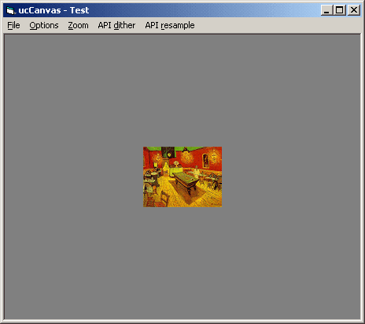



## ucCanvas \+ cDIB revised

### Description

Nothing special: This is a simplified version of a custom control I've been using in several applications. cDIB class has been revised (supports all color depths) and new functions added. For NT users, new StretchBltMode parameter (Paint() and Stretch() functions), allowing [Halftone] mode for API-dithering (ordered dither). Note: If you only want to preview images, pass [Force32bpp]=True (->CreateFromStdPicture); this will improve zoom/scroll behavior (specialy on palette based bitmaps). // 14Kb zip
 
### More Info
 

             |
---                |---
**Submitted On**   |2004-09-16 13:05:46
**By**             |[Carles P\.V\.](https://github.com/Planet-Source-Code/PSCIndex/blob/master/ByAuthor/carles-p-v.md)
**Level**          |Intermediate
**User Rating**    |5.0 (40 globes from 8 users)
**Compatibility**  |VB 6\.0
**Category**       |[Custom Controls/ Forms/  Menus](https://github.com/Planet-Source-Code/PSCIndex/blob/master/ByCategory/custom-controls-forms-menus__1-4.md)
**World**          |[Visual Basic](https://github.com/Planet-Source-Code/PSCIndex/blob/master/ByWorld/visual-basic.md)
**Archive File**   |[ucCanvas\_\+1795879202004\.zip](https://github.com/Planet-Source-Code/carles-p-v-uccanvas-cdib-revised__1-56193/archive/master.zip)

